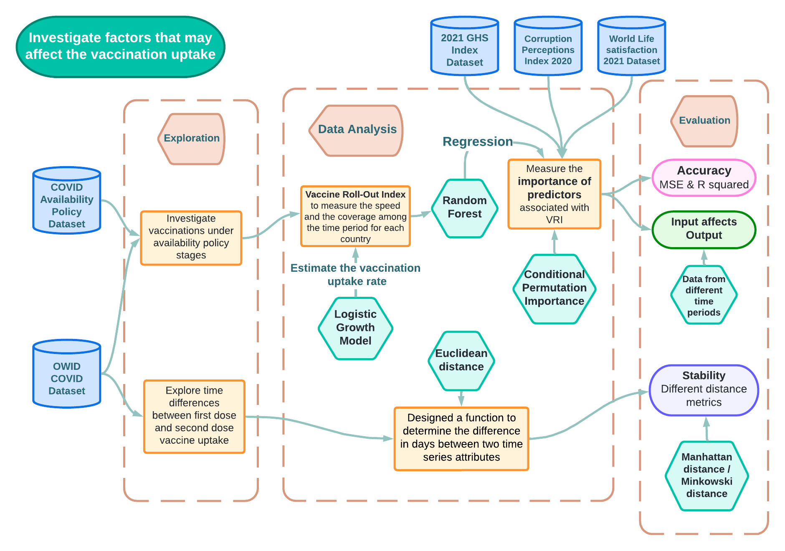
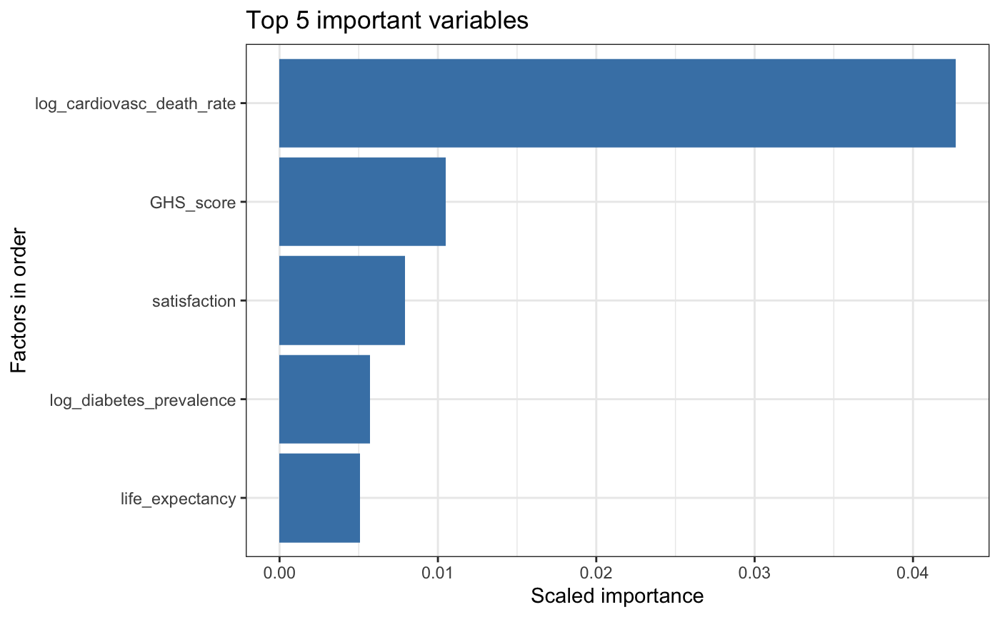

<style>
/* resize the widget container */
.plotly { 
  width: 100% !important;
}

/* center the widget */
div.svg-container {
  margin: auto !important;
}
</style>

```{r setup, include=FALSE}
knitr::opts_chunk$set(
  echo = TRUE,    # for final report, set to FALSE to hide all code chunks
  message = FALSE,
  warning = FALSE,
  fig.align = "center",
  fig.cap = "",
  cache = TRUE
)
```

```{r libraries}
library(tidyverse)
library(kableExtra)
library(DT)
library(plotly)
library(readxl)
library(ggthemes)
library(maps)

library(viridis) # Color gradients
library(lubridate)
library(qtlcharts) # Interactive scatter plots 

library(randomForest) 
library(ranger)       # a faster implementation of randomForest
library(caret)        # performe many machine learning models
library(broom)  # try: `install.packages("backports")` if diretly installing broom gives an error

library(reshape2) # to use melt()

library(deSolve)
library(permimp) # for calculating conditional importance in a speedy way
```


# Executive Summary

This report aims to investigate factors that affected the implementation of the global COVID-19 vaccination rollout. Specifically, this report investigates the time lag between the 1st and 2nd vaccine dose inoculation to quantitatively determine the delay in the vaccinated population achieving full immunity. It is found that the majority of country time lags are between 1-2 months, showing that the multiple dose nature of the vaccine rollout causes a considerable delay in achieving full immunity.

In addition, the influence of various demographic, socio-economic and health factors on vaccination speed and coverage is algorithmically assessed. It is found that the log of cardiovascular disease, GHS index and life satisfaction have the greatest influence on the vaccination rollout index, an index that conveys both speed and coverage of the vaccination rollout. 

These results can be utilised by epidemiologists or research students to inform their research into how to achieve greater success and efficiency with future vaccine rollouts. The analysis in this report has additionally been represented in an interactive Shiny application.

The following schematic diagram (Figure \@ref(fig:flowchart)) shows the steps undertaken to investigate the two main questions in this study:

<center>

{width=90%}

</center>

# Background and Motivation

Since the 8th of December 2020, COVID-19 vaccines have been developed and administered to the public. There has been strong evidence of the success of COVID-19 vaccines in reducing fatalities, severe infections, and hospitalisations [@Deb]. Given the effectiveness of vaccines, it is appropriate to evaluate potential factors affecting the speed and coverage of the vaccine rollout. If certain demographic, socio-economic or health factors can be shown to influence vaccine rollout, it can help address efforts to improve vaccine uptake outcomes.

The speed at which the vaccinated population was provided full immunity was affected by the multiple dose design of the vaccine rollout. One dose provides partial immunity and, after a length of time, an additional dose is required to achieve full immunity. The delay in achieving full immunity is a key factor in how quickly full immunity can be provided to a population, influencing the effectiveness of a multiple dose rollout.


## Data

```{r data-loadin, warning=FALSE, results='hide'}
covid_data = read_csv("data/covid_data_latest.csv")
covid_data$date = ymd(covid_data$date)

policy = read_csv("data/covid-vaccination-policy.csv")
policy$Day = ymd(policy$Day)


happiness = read_csv("data/happiness-cantril-ladder.csv")
ghs = read_csv("data/2021-GHS-Index-April-2022.csv")
corruption = read_xlsx("data/CPI2020_GlobalTablesTS_210125.xlsx", sheet=1, skip=2)

source("data/ct_model.R")
```

The COVID-19 time-series dataset provided by the ‘Our World in Data’ online publication [@owidcoronavirus] was the primary dataset analysed. This dataset contains data on 207 countries, with measured attributes such as COVID-19 cases, deaths, tests and vaccinations. A COVID vaccination policy dataset from the same source [@owidcoronavirus] was also explored in this report, providing time-series data for COVID-19 vaccination availability in 207 countries, represented as a categorical index.

The following datasets were used to provide predictive factors for the vaccine rollout:

1. The Global health security (GHS) index data, was sourced from the GHS index repository. It measures the capacity for 195 countries to prepare for pandemics from 2021 to 2022. [@ghs]

2. ‘Our World in Data: Happiness and Life Satisfaction' dataset contains variables providing measures of happiness and life satisfaction on 160 countries. [@owidhappinessandlifesatisfaction]
 
3. The Corruption Perceptions Index dataset contains data of perceptions of public sector corruption. The index ranges from 0 to 100, whereby 0 corresponds to maximal corruption. [@cpi]


# Methods

## Time lag between 1st and 2nd dose {#time-lag}

To calculate the time lag between a vaccinated population receiving the 1st and 2nd vaccine dose, the distance/difference in days between the people vaccinated (at least 1 vaccine dose) and people fully vaccinated (2 vaccine doses) time-series attributes was calculated. This was achieved by continuously shifting the time-series attribute curves until the curves, which both follow logistic functions, are roughly overlapping. When overlapping occurs, the distance between the two time-series attributes is minimized. The distance that will be used in this analysis is Euclidean distance. The number of times the curves need to be shifted to achieve minimal distance is the difference in days between the two time-series attributes.
 
The time lag will be calculated for each country, during the period of the 1st of February 2021 to the 1st of August 2021, except for a subset of countries that do not have a population greater than 1,500,000 people and whose data on vaccine uptake is not adequate.

```{r smoother}
# smoother function, returns smoothed column

Lowess <- function(data, f) {
  lowess_fit <- lowess(data, f = f)
  return(lowess_fit$y)
}
lag_covid = covid_data
lag_covid = lag_covid %>%
  filter(population > 1500000) %>%
  filter(gdp_per_capita > 0)
countrys <- unique(lag_covid$location)
deleted <- c("Afghanistan", "Antigua and Barbuda", "Bangladesh","Benin", "Bhutan", "Bonaire Sint Eustatius and Saba", "Botswana", "Burundi","Burkina Faso", "Cameroon", "Cote d'Ivoire", "Democratic Republic of Congo", "Ethiopia","Eritrea", "Gabon", "Ghana", "Guernsey", "Guinea", "Kenya", "Kuwait", "Liberia", "Laos", "Namibia", "Nepal","Nicaragua", "Niger", "Nigeria", "Palestine", "Philippines", "Pitcairn", "Rwanda", "Saint Helena", "Senegal", "Sierra Leone", "Somalia", "South Sudan", "Sudan", "Tokelau", "Turkmenistan","Tanzania", "Uganda","Yemen", "World", "Zambia")
countrys = countrys[! countrys %in% deleted]
lag_covid = select(lag_covid, "date", "location", "people_vaccinated_per_hundred", "people_fully_vaccinated_per_hundred")
start_date = "2021-02-01"
end_date = "2021-08-01"
lag_covid = lag_covid %>% filter(date >= start_date & date < end_date)
lag_covid$people_vaccinated_per_hundred[is.na(lag_covid$people_vaccinated_per_hundred)] = 0
lag_covid$people_fully_vaccinated_per_hundred[is.na(lag_covid$people_fully_vaccinated_per_hundred)] = 0

lagValue <- function(FirstDose, SecondDose, windowsize, p)
{
  # vector for all measures of distance between matrices
  dist_vector = c()
  i = 1
  while (i <= windowsize){
    # select different subsets of matrices, calculate the distances between the 2 matrices and store the distance. This while loop will contain information for 1st vaccine lag
    FirstDose_subset <- FirstDose[i:nrow(FirstDose),1]
    SecondDose_subset <- SecondDose[1:(1 - i + nrow(SecondDose)),1]
    dist_FirstDose <- proxy::dist(t(FirstDose_subset), t(SecondDose_subset), method = "Minkowski", p = p)
    dist_vector = c(dist_vector, dist_FirstDose)
    i = i + 1
  }
  
  
  j = 1
  while (j <= windowsize){
    # select different subsets of matrices, calculate the distances between the 2 matrices and store the distance. This while loop will contain information for 2nd vaccine lag
    FirstDose_subset1 <- FirstDose[1:(1 - j + nrow(FirstDose)),1]
    SecondDose_subset1 <- SecondDose[j:nrow(SecondDose),1]
    dist_SecondDose <- proxy::dist(t(FirstDose_subset1), t(SecondDose_subset1), method = "Minkowski", p = p)
    dist_vector = c(dist_vector, dist_SecondDose)
    j = j + 1
  }
  
  # select min value index which corresponds to value of the lag
  return(which.min(dist_vector))
}  
```

```{r timelag}
lag_vector_1 <- c()
lag_vector_2 <- c()
lag_vector_3 <- c()
# loop through each country and calculate 3 time lags: manhattan distance, euclidean distance and minkowski (p=3) time lags
p = 1
while (p <= 3){
  z = 1
  while (z <= length(countrys)){
    # only select records for certain country and only select 1st and 2nd vaccine columns
    lagCovid_filtered = filter(lag_covid, location == countrys[z])
    combined_matrix <- cbind(lagCovid_filtered[,3], lagCovid_filtered[,4])
    
    # In the dataset, there are missing values. Will replace these missing values (0) with the value from the date before. Do it for both 1st and 2nd vaccine columns
    
    for (i in 1:nrow(combined_matrix)){
      if (i == 1){
      } else{
        if (combined_matrix[i,1] == 0){
          combined_matrix[i,1] = combined_matrix[i-1, 1]
        }
      }
    }
    
    for (j in 1:nrow(combined_matrix)){
      if (j == 1){
      } else{
        if (combined_matrix[j,2] == 0){
          combined_matrix[j,2] = combined_matrix[j-1, 2]
        }
      }
    }
    
    # Apply smoothing function to 1st and 2nd vaccine columns. f = 0.15 is an arbitrary value
    
    combined_matrix_smooth<- as.matrix(apply(combined_matrix, 2, Lowess, f = 0.15))
    
    # Store each column separately as individual matrices
    FirstDose_matrix = as.matrix(combined_matrix_smooth[,1])
    SecondDose_matrix = as.matrix(combined_matrix_smooth[,2])
    
    # Input the individual matrices into the lagValue function to find the lag between the 1st and 2nd dose for a particular country
    lag <- lagValue(FirstDose_matrix, SecondDose_matrix, windowsize=100, p)
    
    #store value of lag
    if (p == 1){
      lag_vector_1 <- c(lag_vector_1, lag)
    } else if (p == 2){
      lag_vector_2 <- c(lag_vector_2, lag)
    } else {
      lag_vector_3 <- c(lag_vector_3, lag)
    }
    z = z + 1
  }
  p = p + 1
}
# label the lag values with the corresponding country
names(lag_vector_1) <- countrys
names(lag_vector_2) <- countrys
names(lag_vector_3) <- countrys
# function to explain the time lag value

lagType <- function(lag, windowsize)
{ # Function to convert indice value given by lagValue to a value for the Time Lag.
  # Any lag values that are greater than windowsize were part of the 2nd half of the 'dist_vector' from the lagValue function, the half of the vector for the 2nd vaccine lag.
  # Therefore need to subtract off all the days from the 1st half of the 'dist_vector' to get number of days for 2nd vaccine lag.
  # No such issue for 1st vaccine lag as all values are within first half.
  if (lag > windowsize){
    return(c(LagType = "Second Dose Lag", Lag = lag - windowsize - 1))
  } else {
    return(c(LagType = "First Dose Lag", Lag = lag - 1))
  }
}
# Apply function to each country's Time lag value 
lag_df_1 = mapply(lagType, lag = lag_vector_1, windowsize = 100)
lag_df_2 = mapply(lagType, lag = lag_vector_2, windowsize = 100)
lag_df_3 = mapply(lagType, lag = lag_vector_3, windowsize = 100)

# Visualise Time lags

total_lag = cbind(t(lag_df_1), t(lag_df_2), t(lag_df_3))
colnames(total_lag) = c("LagType", "Lag: Euclidean distance", "LagType", "Lag: Manhattan distance", "LagType", "Lag: Minkowksi distance (P=3)")
```


## Vaccine rollout index (VRI) and variable importance {#vri}

### Exploration

The vaccine availability policy data for each country contains an index representing which groups of people can access vaccines, with larger index values representing greater access. For each stage of availability, the speed of vaccination was derived using the slope of the number of people vaccinated over time in each period. As evident in the bar chart (Figure \@ref(fig:availability-graph)) below, stages 3 and 4 have the highest speed and stage 5 has a lower speed. Despite stage 5 allowing greater access, this decrease in vaccination speed can be attributed to a significant proportion of the population being already vaccinated in stages 3 and 4. Greater availability doesn’t correlate with higher vaccination speed. Rather, there are other factors that affect vaccination uptake.

```{r policy-clean}
# Country list
countries = c("United States", "India", "Brazil", "France", "United Kingdom", "Russia", 
              "Turkey", "Italy", "Germany", "Spain", "Argentina",
                "Iran", "Colombia", "Poland", 'Mexico', "Netherlands", 
              "Indonesia", "Ukraine", "South Africa", "Philippines", "Peru", "Belgium",
                "Czechia", "Japan", "Iran")

# Select certain countreis
policy_data <- covid_data %>% 
  filter(location %in% countries)

policy <- policy %>% filter(Entity %in% countries)

policy_data <- policy_data %>% 
  select(iso_code, continent, location, date,new_people_vaccinated_smoothed_per_hundred,  new_people_vaccinated_smoothed, new_vaccinations, new_vaccinations_smoothed, new_vaccinations_smoothed_per_million, population, people_vaccinated)

# Merge the policy data with the COVID data
policy_data <- merge(policy_data, policy, by.x = c('iso_code', "date", "location"), by.y = c('Code', 'Day', "Entity"))
```

```{r get-slope}
#The 'get slope' function was created to calculate the slope of each country's vaccination policy from stage 1 to stage 5. The slope is calculated using the lm function. This is then extracted and stored in a slope. The slope is essentially the speed of vaccination uptake with respect to the vaccination policy, which is then compared to other countries in a graph.
get_slope <- function(country_data, country_policy, country) {
  i = 1
  country_slope <- data.frame(policy = as.factor(1:5), speed = rep(0, 5), country = rep(country, 5))
  
  while (i <= length(country_policy$vaccination_policy)) {
    
    # Select current policy
    current_policy = country_policy$vaccination_policy[i]
    
    if (current_policy > 0 & !is.na(country_policy$people_vaccinated[country_policy$vaccination_policy == current_policy])) {
      
      # Extract the number of people vaccinated
      temp_people <- country_data$people_vaccinated[country_data$vaccination_policy == current_policy & !is.na(country_data$people_vaccinated)] / country_data$population[1]

      temp_index <- 1:length(temp_people)
      
      if (length(temp_index) > 1) {
        # Linear model
        mod <- lm(temp_people ~ temp_index)
        
        # Extract and store the slope
        country_slope$speed[country_slope$policy == current_policy] <- summary(mod)$coefficients[2,1]
      } else {
        # Some countries only have a policy for 1 day -> treat the slope as 0
        country_slope$speed[country_slope$policy == current_policy] <- 0
      }
      
    } 
    
    i <- i + 1
    
  }
  
  return(country_slope)
}
```

```{r availability-graph, fig.cap = "The vaccination speed for different policy periods for selected countries"}
country_slope = NULL

#loop through the countries in the dataset and subset the required variables in another dataframe
for (country in countries) {
  country_data <- policy_data[policy_data$location == country, ]
  
  country_policy <- country_data[!is.na(country_data$people_vaccinated), ] %>%
    group_by(vaccination_policy) %>%
    arrange(date) %>%
    slice(1L) %>%
    select(iso_code, location, date, vaccination_policy, new_vaccinations_smoothed, population, people_vaccinated)
  
#Apply the 'get_slope' function to calculate the speed of each country then store in another vector
  temp_slope <- get_slope(country_data, country_policy, country)

  country_slope <- rbind(country_slope, temp_slope)
}

country_slope$policy <- as.factor(country_slope$policy)

# plot the graph
global <- ggplot(data = country_slope, aes(x = country, y = speed, fill = policy)) + 
  geom_bar(stat="identity", position=position_dodge()) +
  theme(axis.text.x = element_text(angle = 90, vjust = 0.5, hjust=1)) + 
  scale_y_sqrt() + 
  ggtitle("All countries") + 
  xlab("Countries") + 
  ylab("Slope") + 
  labs(fill = "Avalability stage")

ggplotly(global) %>% 
  layout(autosize = F, width = '100%', height = '100%')
```

#### VRI

An analysis of how factors affect vaccine uptake requires a measure of vaccine uptake.
Inspired by M.Kazemi's research [@vri], we used a vaccination roll-out index (VRI) to represent both vaccination uptake rate (speed) and coverage in each country. It is defined as

$$VRI=r\cdot \frac{d}{N} \quad$$

whereby, $r$ is the vaccination uptake rate, 
$d$ is the total number of people vaccinated, 
and $N$ is the total population. 
The $d/N$ then measures the coverage of vaccination while $r$ measures the speed. To estimate $r$, two methods were undertaken.

#### Logistic growth model

It is observed that in most countries, the number of people vaccinated roughly follows a logistic growth model, which is consistent with the observations of the aforementioned report [@vri]. Hence, we used a logistic regression to fit the people vaccinated attribute: 

$$c(t) = \frac{K}{1+a{e}^{-rt}}$$

where $c(t)$ is the number of people vaccinated as a function of time $t$, 
$K$ is the number of people vaccinated at the end of the date recorded (the asymptote) and 
$r$ is the vaccination uptake rate. 
The $r$ is estimated from the inverse of the parameter `scal` of the non-linear least squares model fitted in `R`.

#### Asympotic regression

Another approach is investigated to estimate the vaccination uptake rate. The log of the people vaccinated attribute is similar to an asymptotic regression, where the rate of change is a function of the log people vaccinated: 

$$
\log (c(t)) = K + (c(0) - K) e^{-rt}\\
\frac{d}{dt} (log(c(t)) = r(K - \log (c(t))
$$

Here $c(t)$ and $c(0)$ are the same as defined above, 
$K$ is the y-asymptote level, and 
$r$ is the vaccine uptake rate. 
The $r$ is estimated from the exponential of the parameter `lrc` of the non-linear least squares model fitted in `R`.

```{r}
# Example of use, inspect the r_list to see what's included
r_list1 = ct_model(covid_data, log.y = FALSE, model = "logis")

r_list2 = ct_model(covid_data, log.y = TRUE, model = "asymp")

vri_data <- data.frame(bind_rows(r_list1$vri_data))
```

The residual standard error (RSE) was used to assess the fit of the models to the people vaccinated attribute. The mean RSE over all the locations is `r round(mean(unlist(r_list1$rse), na.rm = TRUE), 2)` for the logistic model, which is lower than `r round(mean(unlist(r_list2$rse), na.rm = TRUE), 2)` for the asymptotic regression. Therefore, the logistic model was the most appropriate method for estimating the vaccination uptake parameter.


#### Selecting predictors of VRI and Preprocessing

Multiple socio-economic, demographic and health-related factors have been considered as potential predictors of a country’s VRI. [@maleva2021a, @JohnE] The full list of predictors used is documented in the Appendix (Table \@ref(tab:variable-list)). Log transformation is performed to some attributes to mitigate the problem of highly skewed data. The different scales of variables necessitated min-max normalization to restrict all variables to within 0 and 1. 

For each predictor, we investigated its relationship with VRI using a scatter plot as well as a Spearman correlation heatmap. All plots are located in the Appendix (Figure \@ref(fig:correlation)). 

```{r}
# Merge the datasets
corruption <- corruption %>% select(c("ISO3", "CPI score 2020")) 

happiness <- happiness %>% group_by(Code) %>%
  arrange(Year) %>%
  filter(!is.na(`Life satisfaction in Cantril Ladder (World Happiness Report 2021)`)) %>%
  dplyr::summarise(satisfaction=last(`Life satisfaction in Cantril Ladder (World Happiness Report 2021)`)) 


joint_data <- merge(vri_data,corruption,  by.x=c("iso_code"), by.y=c("ISO3"))

joint_data <- merge(joint_data,happiness, by.x=c("iso_code"), by.y=c("Code"))

# GHE-INDEX
ghs <- ghs %>% filter(Year == 2021) %>% select(Country,`OVERALL SCORE`)

## adding iso code to ghs dataset
ghs <- ghs %>% mutate(iso_code = iso.alpha(Country, 3), .before = 1)
ghs <- ghs %>% mutate(
  iso_code = case_when(
    !is.na(iso_code) ~ iso_code,
    Country == "Bosnia and Hercegovina" ~ "BIH",
    Country == "Cabo Verde" ~ "CPV",
    Country == "Congo (Brazzaville)" ~ "COG",
    Country == "Congo (Democratic Republic)" ~ "COD",
    Country == "Côte d'Ivoire" ~ "CIV",
    Country == "eSwatini" ~ "BIH",
    Country == "Kyrgyz Republic" ~ "KGZ",
    Country == "São Tomé and Príncipe" ~ "STP",
    Country == "St Kitts & Nevis" ~ "KNA",
    Country == "St Lucia" ~ "LCA",
    Country == "St Vincent & The Grenadines" ~ "VCT",
    Country == "United Kingdom" ~ "GBR",
    Country == "United States of America" ~ "USA"
  )
)


joint_data <- merge(joint_data, ghs[,-2],  by.x=c("iso_code"), by.y=c("iso_code"))
colnames(joint_data)[16] <- "GHS_score"
```


```{r}
# take log for highly skewed variables
vri_extra_logged = joint_data %>% select(-population) %>%
  mutate(
    across(.cols = c(population_density, aged_65_older, gdp_per_capita, hospital_beds_per_thousand, cardiovasc_death_rate, extreme_poverty, diabetes_prevalence),
           ~log(.))
  ) %>% 
  rename_with(.cols = c(population_density, aged_65_older, gdp_per_capita, hospital_beds_per_thousand, cardiovasc_death_rate, extreme_poverty, diabetes_prevalence),
              .fn = ~paste0("log_", .))


min_max_norm <- function(x) {
    (x - min(x,na.rm = TRUE)) / (max(x,na.rm = TRUE) - min(x,na.rm = TRUE))
}

scaled_data <- data.frame(lapply(vri_extra_logged[4:15], min_max_norm), vri = vri_extra_logged$vri)

scaled_data_cleaned <- scaled_data %>% filter( !is.na(vri) & !is.na(log_population_density)& 
                                    !is.na(log_gdp_per_capita) &!is.na(log_aged_65_older)&
                                      !is.na(log_extreme_poverty)&
                                      !is.na(human_development_index)& 
                                      !is.na(log_cardiovasc_death_rate)& 
                                      !is.na(log_hospital_beds_per_thousand)) %>% 
                                 select(c(vri,log_gdp_per_capita,log_aged_65_older,log_population_density,
                                     CPI.score.2020,log_extreme_poverty,
                                     satisfaction,life_expectancy,human_development_index,
                                     log_cardiovasc_death_rate,log_diabetes_prevalence,
                                     log_hospital_beds_per_thousand, GHS_score)) 

```

```{r}
# Appendix

spearman <- cor(scaled_data_cleaned, use="pairwise.complete.obs", method="spearman")

heatmap <- qtlcharts::iplotCorr(
  scaled_data_cleaned,
  reorder=TRUE,
  corr = spearman,
  chartOpts = list(cortitle = "Spearman's correlation")
)
```

```{r}
# Remove population_density based on scatter plot and correlation heatmap

scaled_data_cleaned <- scaled_data_cleaned %>% select(-log_population_density)
```

#### Random forest regression and variable importance

Random forest (RF) regression is a non-parametric algorithm that can handle feature selection problems with numerous highly correlated variables. [@Dewi2019] The nature of bagging and ensemble techniques used in RF also reduces the likelihood of the model being adversely affected by outliers. Further, the calculation of variable importance in RF covers not only the impact of predictor variables individually but also interactively with other predictor variables. [@importance] Hence, RF is an appropriate algorithm for modeling VRIs with the predictor attributes. The association between predictor attributes and VRI was measured by calculating their conditional permutation importance (CPI). The original permutation importance was measured by the mean decrease in error of a RF before and after permuting its values, reflecting its contribution to modeling the response variable. CPI enhanced the permutation approach whereby the permutation of a predictor will be based on the variable with which it is significantly related to, according to a user-defined threshold ([0,1]), thereby reducing the bias resulting from correlated covariates when computing variable importance. [@importance2]


```{r warning=FALSE, message=FALSE}
# hyper parameter grid search 
## The importance results are produced on mac
mtry <-  seq(2, 6, by = 1)
num_trees <- c(100,150,200,250,300,350,400,450,500)


# Manual Search
#control <- trainControl(method="cv", number=3, search="grid")
grid_param <- expand.grid(.mtry=mtry)
modellist <- list()
set.seed(3888)
for (ntree in num_trees) {
	fit <- train( vri~., 
                      data= scaled_data_cleaned, 
                      method='rf', 
                      tuneGrid=grid_param, 
	                    ntree= ntree,
	                    importance=TRUE,
                      trControl=trainControl(method='cv', 
                        number=5) )
	key <- toString(ntree)
	modellist[[key]] <- fit$finalModel

}


## COMPARE RESULTS

lowest_mse <- 1
model_mse <- modellist[[1]]
highest_r2 <- 0
model_r2 <- modellist[[1]]
  
for (i in c(1:length(modellist))) {

  result <- predict(modellist[[i]], newdata=scaled_data_cleaned %>% select(-vri))
  result_avg <- mean(scaled_data_cleaned$vri)
  mse = mean((scaled_data_cleaned$vri - result)^2)
  r2 = 1 - (sum((scaled_data_cleaned$vri - result)^2))/(sum((scaled_data_cleaned$vri - result_avg)^2))
  if (highest_r2 < r2){
     highest_r2 = r2
     model_r2 = modellist[[i]]
  }
  if (lowest_mse > mse) {
    lowest_mse = mse
    model_mse = modellist[[i]]
  }

 
}

# Calculating importance of features to the model: Handling multicollinear features by using conditional permutation

## https://cran.r-project.org/web/packages/permimp/vignettes/permimp-package.html

set.seed(3888)
optimal_rf <- randomForest(vri ~ ., data= scaled_data_cleaned, mtry = 2, keep.forest = TRUE, keep.inbag = FALSE, ntree= 300)
## compute permutation importance
rf_permimp <- permimp(optimal_rf, progressBar = FALSE, conditional = TRUE,scaled = TRUE, thresholdDiagnostics = TRUE,type="response",do_check = FALSE)

vimp <- as.data.frame(rf_permimp$values)
colnames(vimp)[1] <- "importance"
vimp <- round(vimp, 4)
vimp$var <- row.names(vimp)

options(scipen=999)
vimp <- vimp %>%
  arrange(desc(importance)) %>%
  slice(1:5)
vimp <- vimp %>%
  ggplot(aes(reorder(var,importance), importance)) +
  geom_col(fill="steelblue") +
  coord_flip() +
  theme_bw()+
  ggtitle("Top 5 important variables") +
  xlab("Factors in order") +
  ylab("Scaled importance")


## The permimp() function is sensitive to operating systems, so we save the results of importance
# png(filename="importance.png")
# vimp
# dev.off()
```

A hyper-parameter grid search was run, with 5-fold cross-validation, to find the optimal hyper-parameters for the RF (number of trees and number of features included in the split), based on mean squared error and $R^2$ values. 


# Results and Evaluation

## Time Lag

The median time lag of 112 countries was 40.5 days. Cambodia had the smallest time lag value: 18 days. The maximum value was >99 days, the value for multiple countries: Algeria, Congo, Libya, Sri Lanka and Malawi. The interquartile range, a measure of the spread of time lag values, was 31.5 days. The time lag values for individual countries can be seen in Table \@ref(tab:timelag-dtable) below.

```{r timelag-dtable}
# datatable(total_lag, options = list(columnDefs = list(list(className = 'dt-center', targets = "_all"))), caption = "List of different time lags measures for each country.")

total_lag %>% 
  kbl(caption = "List of different time lags measures for each country.",
      format = "html", 
      booktabs = TRUE, 
      row.names = FALSE, 
      escape = TRUE,
      align = "c") %>% 
  kable_styling(bootstrap_options = c("condensed", "striped", "hover"),
                position = "center") %>% 
  scroll_box(height = "400px")
```
<br>

In evaluating the stability of the time lag derivation model, it is noted that the model is stable for different distance metrics. Results for time lags with distance metrics like Manhattan distance and Minkowski distance (p parameter equals 3) yielded similar results to the Euclidean distance time lags. (Figure \@ref(fig:timelag-boxplot))

```{r timelag-boxplot, fig.cap="Boxplot results of time lags for each distance metric."}
# Box plots of time lags for all 3 types of time lags measurements

total_lag_df <- as.data.frame(total_lag)
colnames(total_lag_df) = c("LagType", "LagEuclideanDistance", "LagType", "LagManhattanDistance","LagType", "LagMinkowskiDistanceP3")

box <- plot_ly(type = "box")
box <- box %>% add_boxplot(x = total_lag_df$LagManhattanDistance, boxpoints = "all", jitter = 0.3, name = "Manhattan Distance")
box <- box %>% add_boxplot(x = total_lag_df$LagEuclideanDistance, boxpoints = "all", jitter = 0.3, name = "Euclidean Distance")
box <- box %>% add_boxplot(x = total_lag_df$LagMinkowskiDistanceP3, boxpoints = "all", jitter = 0.3, name = "Minkowski Distance (P=3)")
box <- box %>% layout(title = "Box Plot of Lag Between 1st and 2nd Dose", autosize = F, width = '100%', height = '100%')
box
```


Despite different ways of calculating distance, the model is still able to interpret the same roughly equivalent distances between the two time-series attributes.


## VRI

### Results of VRI

A summary of VRIs are in Table \@ref(tab:vri-result-summary) in the appendix. The 7 right side outliers (\@ref(fig:vri-bplot)) were: Nauru(0.152543), Saint Helena(0.143903), Gibraltar(0.052261), Nicaragua(0.043231), San Marino(0.040336), Mongolia(0.039360) and Seychelles(0.039159). The countries with lowest VRIs are Burundi(0.000039), Yemen(0.000180), and Haiti(0.000411). 

### Results of the optimal RF and variable importance

The random forest regressor with optimal hyper-parameters involved building 300 trees with 2 variables considered at a split. The MSE and R squared were approximately $9.38 × 10^{-6}$ and 0.8852 respectively. The top 5 important predictors were: 

1. log of death rate from cardiovascular disease 
2. Global Health and Security Index 
3. life satisfaction 
4. log of diabetes prevalence
5. log of life expectancy at birth

<center>

{width=55%,height=55%}

</center>


### Evaluation

Evaluation of model accuracy involved assessing the mean square error (MSE) and the coefficient of determination $R^2$. The MSE measures the closeness between prediction and observed value while $R^2$ represents the proportion of the predictors’ variance explained by our index VRI. The lower the MSE and the higher the $R^2$, the more accurate the model.

```{r vri-eval-time}
#VRI 
start <- min(covid_data$date[!is.na(covid_data$people_vaccinated)])
end <- start %m+% months(4)

r_list4 = ct_model(covid_data[start <= covid_data$date & covid_data$date < end, ], log.y = FALSE, model = "logis")
temp_data <- data.frame(bind_rows(r_list4$vri_data))
temp_data <- data.frame(vri4 = temp_data$vri, temp_data %>% select(-vri))
vri_eva_data <- temp_data


start <- min(covid_data$date[!is.na(covid_data$people_vaccinated)])
start <- start %m+% months(4)
end <- start %m+% months(8)

r_list8 = ct_model(covid_data[start <= covid_data$date & covid_data$date < end, ], log.y = FALSE, model = "logis")
temp_data <- data.frame(bind_rows(r_list8$vri_data))
temp_data <- data.frame(vri8 = temp_data$vri, location = temp_data$location)
vri_eva_data <- merge(vri_eva_data, temp_data, by = "location")

start <- min(covid_data$date[!is.na(covid_data$people_vaccinated)])
start <- start %m+% months(8)

r_listf = ct_model(covid_data[start <= covid_data$date & covid_data$date < end, ], log.y = FALSE, model = "logis")
temp_data <- data.frame(bind_rows(r_listf$vri_data))
temp_data <- data.frame(vrif = temp_data$vri, location = temp_data$location)
vri_eva_data <- merge(vri_eva_data, temp_data, by = "location")
```

As VRI is highly related to time, the time period chosen can affect results. This concept is explored as: Input affects Output”. The period of time between commencement of vaccinations and the last day recorded varies from 1 to 1.5 years in the covid dataset. Therefore, the dataset was separated into $0-4$ months, $4-8$ months, and $8-\text{latest}$ starting on the first day a country had vaccination data. For each selected period, the accuracy was compared using MSE and R squared. 

```{r}
# Merge the datasets
joint_data <- merge(vri_eva_data,corruption,  by.x=c("iso_code"), by.y=c("ISO3"))

joint_data <- merge(joint_data,happiness, by.x=c("iso_code"), by.y=c("Code"))

ghs <- ghs %>% mutate(
  iso_code = case_when(
    !is.na(iso_code) ~ iso_code,
    Country == "Bosnia and Hercegovina" ~ "BIH",
    Country == "Cabo Verde" ~ "CPV",
    Country == "Congo (Brazzaville)" ~ "COG",
    Country == "Congo (Democratic Republic)" ~ "COD",
    Country == "Côte d'Ivoire" ~ "CIV",
    Country == "eSwatini" ~ "BIH",
    Country == "Kyrgyz Republic" ~ "KGZ",
    Country == "São Tomé and Príncipe" ~ "STP",
    Country == "St Kitts & Nevis" ~ "KNA",
    Country == "St Lucia" ~ "LCA",
    Country == "St Vincent & The Grenadines" ~ "VCT",
    Country == "United Kingdom" ~ "GBR",
    Country == "United States of America" ~ "USA"
  )
)


joint_data <- merge(joint_data, ghs[,-2],  by.x=c("iso_code"), by.y=c("iso_code"))
colnames(joint_data)[18] <- "GHS_score"
```

The dataset between 4 to 8 months has the highest R squared and lowest MSE, 0.83 and 0.000013. For input between 0 to 4 months and 8 to the latest day, R squared is similar: approximately 0.78. However, the 8-month to latest data has the highest MSE, 0.000031, while 0 to 4 months data’s MSE is 0.000014. Accordingly, it is concluded that the time period of input data does affect model output which is most accurate on data between 4 to 8 months. (Appendix: Table \@ref(tab:vri-eval-table))

```{r}
# take log for highly skewed variables
vri_extra_logged = joint_data %>% select(-population) %>%
  mutate(
    across(.cols = c(population_density, aged_65_older, gdp_per_capita, hospital_beds_per_thousand, cardiovasc_death_rate, extreme_poverty, diabetes_prevalence),
           ~log(.))
  ) %>% 
  rename_with(.cols = c(population_density, aged_65_older, gdp_per_capita, hospital_beds_per_thousand, cardiovasc_death_rate, extreme_poverty, diabetes_prevalence),
              .fn = ~paste0("log_", .))

min_max_norm <- function(x) {
    (x - min(x,na.rm = TRUE)) / (max(x,na.rm = TRUE) - min(x,na.rm = TRUE))
}

scaled_data <- data.frame(lapply(vri_extra_logged %>% select(-iso_code, -location, -vri4, -vri8, -vrif), min_max_norm), vri4 = vri_extra_logged$vri4, vri8 = vri_extra_logged$vri8, vrif = vri_extra_logged$vrif)

# Removing NAs:
scaled_data_cleaned <- scaled_data %>% filter(!is.na(vri4) &
                                                !is.na(vri8) &
                                                !is.na(vrif) &
                                                !is.na(log_population_density) &
                                                !is.na(log_gdp_per_capita) &
                                                !is.na(log_aged_65_older)&
                                                !is.na(log_extreme_poverty)&
                                                !is.na(human_development_index)&
                                                !is.na(log_cardiovasc_death_rate)&
                                                !is.na(log_hospital_beds_per_thousand)) %>%
  select(c(vri4, vri8, vrif, log_gdp_per_capita,log_aged_65_older,log_population_density,CPI.score.2020,
           log_extreme_poverty,satisfaction,life_expectancy,human_development_index,
           log_cardiovasc_death_rate,log_diabetes_prevalence,log_hospital_beds_per_thousand, GHS_score)) 


# hyper parameter grid search (definitely need a bit modify)
mtry <-  seq(2, 12, by = 1)
num_trees <- c(100,150,200,250,300,350,400,450,500)

timeperiod <- c()

# VRI between 0 to 4 months
# Manual Search
grid_param <- expand.grid(.mtry=mtry)
modellist <- list()
for (ntree in num_trees) {
	fit <- train( vri4~., 
                      data= scaled_data_cleaned %>% select(-vri8, -vrif), 
                      method='rf', 
                      tuneGrid=grid_param, 
	                    ntree= ntree,
                      trControl=trainControl(method='cv', 
                        number=3) )
	key <- toString(ntree)
	modellist[[key]] <- fit$finalModel

}


## COMPARE RESULTS
lowest_mse_4 <- 1
model_mse_4 <- modellist[[1]]
highest_r2_4 <- 0
model_r2_4 <- modellist[[1]]

for (i in c(1:length(modellist))) {

  result <- predict(modellist[[i]], newdata=scaled_data_cleaned %>% select(-vri4, -vri8, -vrif))
  result_avg <- mean(scaled_data_cleaned$vri4)
  mse = mean((scaled_data_cleaned$vri4 - result)^2)
  r2 = 1 - (sum((scaled_data_cleaned$vri4 - result)^2))/(sum((scaled_data_cleaned$vri4 - result_avg)^2))
  if (highest_r2_4 < r2){
     highest_r2_4 = r2
     model_r2_4 = modellist[[i]]
  }
  if (lowest_mse_4 > mse) {
    lowest_mse_4 = mse
    model_mse_4 = modellist[[i]]
  }
 
}


# VRI between 4 to 8 months

# Manual Search
grid_param <- expand.grid(.mtry=mtry)
modellist <- list()
for (ntree in num_trees) {
	fit <- train( vri8~., 
                      data= scaled_data_cleaned %>% select(-vri4, -vrif), 
                      method='rf', 
                      tuneGrid=grid_param, 
	                    ntree= ntree,
                      trControl=trainControl(method='cv', 
                        number=3) )
	key <- toString(ntree)
	modellist[[key]] <- fit$finalModel

}


## COMPARE RESULTS

lowest_mse_8 <- 1
model_mse_8 <- modellist[[1]]
highest_r2_8 <- 0
model_r2_8 <- modellist[[1]]

for (i in c(1:length(modellist))) {

  result <- predict(modellist[[i]], newdata=scaled_data_cleaned %>% select(-vri4, -vri8, -vrif))
  result_avg <- mean(scaled_data_cleaned$vri8)
  mse = mean((scaled_data_cleaned$vri8 - result)^2)
  r2 = 1 - (sum((scaled_data_cleaned$vri8 - result)^2))/(sum((scaled_data_cleaned$vri8 - result_avg)^2))
  if (highest_r2_8 < r2){
     highest_r2_8 = r2
     model_r2_8 = modellist[[i]]
  }
  if (lowest_mse_8 > mse) {
    lowest_mse_8 = mse
    model_mse_8 = modellist[[i]]
  }
 
}


# VRI between 8 months to latest date

# Manual Search
grid_param <- expand.grid(.mtry=mtry)
modellist <- list()
for (ntree in num_trees) {
	fit <- train( vrif~., 
                      data= scaled_data_cleaned %>% select(-vri8, -vri4), 
                      method='rf', 
                      tuneGrid=grid_param, 
	                    ntree= ntree,
                      trControl=trainControl(method='cv', 
                        number=3) )
	key <- toString(ntree)
	modellist[[key]] <- fit$finalModel

}


## COMPARE RESULTS

lowest_mse_f <- 1
model_mse_f <- modellist[[1]]
highest_r2_f <- 0
model_r2_f <- modellist[[1]]

for (i in c(1:length(modellist))) {

  result <- predict(modellist[[i]], newdata=scaled_data_cleaned %>% select(-vri4, -vri8, -vrif))
  result_avg <- mean(scaled_data_cleaned$vrif)
  mse = mean((scaled_data_cleaned$vrif - result)^2)
  r2 = 1 - (sum((scaled_data_cleaned$vrif - result)^2))/(sum((scaled_data_cleaned$vrif - result_avg)^2))
  if (highest_r2_f < r2){
     highest_r2_f = r2
     model_r2_f = modellist[[i]]
  }
  if (lowest_mse_f > mse) {
    lowest_mse_f = mse
    model_mse_f = modellist[[i]]
  }
 
}


vri_evaluation <- data.frame(`Time period` = c("0 to 4 months", "4 to 8 months", "8 months to current"), MSE = c(lowest_mse_4, lowest_mse_8, lowest_mse_f), `R_squared` = c(highest_r2_4, highest_r2_8, highest_r2_f))

vri_eval_table <- vri_evaluation
```


### Shiny App Results

The results of our project and some analysis processes are illustrated on the Shiny app deployed on [shinyapps.io](https://dcusyd.shinyapps.io/covidApp/). Two layers of heatmap are plotted on an interactive world map to visualise the comparison of results between locations. The “VRI Overlay” shows the VRI values (scaled into 0-1 using logistic regression) and the “Time Lag Overlay” shows the time lags (days) between different locations. Hover-over labels are used to display the specific values. The panel on the right shows the scaled VRI values for all locations and the table can be sorted to show the locations with the highest/lowest scaled VRI. The bottom panel shows location-specific plots and the time lag table for all locations. Users can either click a country on the map or search and select a country from the dropdown menu to see the location-specific information (default Australia). The time lag graph (left) shows the trends of people vaccinated and people fully vaccinated, so that the user can see if the time lag between the two doses changes with time and compare our calculated time lag with the graph. The vaccination trend graph (right) allows the user to see how well our logistic growth model fits the people vaccinated time series so that they can determine how reliable the VRI is.


# Discussion and Limitations {#limitations}

## Time Lag

The results of the time lags between 1st and 2nd vaccine doses convey that there is significant variation between countries. This can be mainly attributed to what brand of vaccines the majority of a country’s population is inoculated with. Different brands of vaccines had different recommended waiting times between doses e.g. the AstraZeneca vaccine had a longer waiting period than the Pfizer and Moderna vaccines (12 weeks vs. 3 & 4 weeks). Accordingly, the United Kingdom, whose population is mostly inoculated with the AstraZeneca vaccine, has a time lag of 76 days, in contrast with the United States 28 day time lag, whose population is mostly inoculated with the Pfizer and Moderna vaccines. 

76 days is a substantial amount of time to be without full immunity, especially in contrast with 28 days. Hence, the judgment can be made that if the United Kingdom, or other countries that had long time lags due to the AstraZeneca vaccine, wanted to achieve full immunity of their vaccinated population as quickly as possible, they should have invested in Pfizer/Moderna vaccines.

Countries within the minimum value and quartile 1 had time lags of 18 days to 30.5 days. This is 3-4 weeks and reflects the expected time lag of countries who inoculated their populations with mostly Pfizer and Moderna vaccines. While these time lags are considerably shorter than other countries, they still reveal that there is a considerable period of time in which vaccinated people are still not fully protected from COVID-19. This identifies a flaw with the multiple dose rollout and encourages epidemiologists and researchers to explore methods of reducing the waiting periods with a multiple dose rollout or producing single dose vaccines that provide full immunity.

## VRI

The results of variable importance show that the death rate of cardiovascular disease has the most influence on the VRI, distinctly more important than other predictors. This reflects that countries that perform comparatively well in managing health issues like cardiovascular disease are likely to perform well in ensuring their population is immunized. Global Health and Security Index and Life satisfaction are the next two most important variables indicating that countries that are prepared for epidemics and where the majority of people are satisfied with their lives will have better vaccine rollout outcomes

## Limitations

1. Some countries, e.g. The Democratic Republic of Congo, have excessive missing data for some variables, resulting in an inability to calculate time lags or VRIs, and thus the analysis cannot cover all countries. This effect gets worse as external datasets are added, containing fewer countries.

2. The discovered factors which affect vaccine uptake may not accurately represent the causal effect, as it’s a model-based result and will change accordingly when hyperparameters, user-defined threshold and even operating systems vary. Further, there may be other factors outside of the used datasets which may also affect vaccine uptake. The problem is that there is no source which contains these variables as comprehensive as the used datasets, which further limits the analysis of the research question. 

3. With an aim of calculating importance instead of predicting VRI, all the data was used as the training set, which could lead to overfitting. 

## Future Improvements

Collecting additional datasets containing other factors to test their effect on the vaccine uptake, such as type of vaccine, people’s trust in health institutions, public perception and individual lifestyle. Exploring more factors will give us a more holistic analysis on vaccination uptake.

The conditional permutation importance is sensitive to the choice of hyper-parameter and user-defined threshold. Though it’s proved to be hard to set sensible values, one future improvement is to evaluate how changes on these pre-set values affect the final result. 


# Conclusion

The conditional permutation importance is sensitive to the choice of hyper-parameter and user-defined threshold. Though it’s proved to be hard to set sensible values, one future improvement is to evaluate how changes on these pre-set values affect the final result. 

The analysis on the influence of demographic, socio-economic and health factors on vaccination speed and coverage found the following factors most influential - the log of cardiovascular disease, GHS index and life satisfaction. This suggests that positive outcomes regarding these factors will correlate with positive vaccination outcomes.

The constructed Shiny application allows users to compare time lags between countries, trends in vaccination speed and availability of vaccines and the accuracy of the measures of vaccine uptake.

Future studies can build on this report by integrating new and more diverse data to explore more relationships between vaccination outcomes and various health, demographic and socio-economic factors.

# Student Contributions

Everyone researched and came up with ideas during exploration, some of which were recorded on our [Github repository](https://github.com/Vighnesh17/DATA3888--COVID) . David mainly developed the idea for the sub-questions while Sylvia researched and proposed  ideas for VRI. 

The model of Time lag was mainly coded and formulated by David, including visualizing and evaluating the results. Aurora and Tina collaborated on the data exploration on VRI based on vaccination availability, while Sylvia built the Random Forest model and calculated the variable importance with data cleaning helped by Vighnesh. Diana further refined the r estimation models, their evaluation, and the VRI calculation. Aurora evaluated the model on the effect of input time selection. Harun created clusters for VRI. Diana wrote all the Shiny app code and Vighnesh and Sylvia wrote the About page.

For the report, Vighnesh wrote the executive summary and collaborated with Tina on the Background and Data section. David contributed majorly to the time lag and result section. For the VRI, Sylvia wrote the methods, results, and discussion while Aurora wrote about exploration and evaluation. Diana wrote the goodness-of-fit evaluation for the asymptotic model and the Shiny app section. Harun wrote the limitations and future improvements along with proofreading the report.


# References

::: {#refs}
:::

# (APPENDIX) Appendix {.unnumbered}

# VRI {#appendix-vri}

## All predictors used

```{r variable-list}
var_list <- data.frame(colnames(joint_data)[5:16])
colnames(var_list) <- "Selected Variable Name"
var_list %>% 
  kbl(caption = "Selected variables for random forrest.",
      format = "html", 
      booktabs = TRUE, 
      row.names = FALSE, 
      escape = TRUE) %>% 
  kable_styling(bootstrap_options = c("condensed", "striped", "hover"),
                position = "center")
```


## Correlation matrix between predictors and VRI

```{r correlation, fig.cap = "Interactive plots of Spearman's correlation heatmap and scatter plots bewteen variables and VRI"}
heatmap
```

## VRI results summary

```{r vri-result-summary}
df_sum <- vri_data %>% select(location, vri)

df_sum %>% 
  kbl(caption = "VRI results for all countries",
      format = "html", 
      booktabs = TRUE, 
      row.names = TRUE, 
      escape = TRUE,
      digits = 4) %>% 
  kable_styling(bootstrap_options = c("condensed", "striped", "hover"),
                position = "center") %>% 
  scroll_box(height = "500px")
```

```{r vri-bplot, fig.cap="Boxplot of VRI values"}
vri_bplot <- ggplot(vri_data,aes(x="",y=vri)) + geom_boxplot(outlier.colour="blue") + ylab("VRI") + xlab("") + ggtitle("Distribution of VRIs") 
ggplotly(vri_bplot) %>% 
  layout(autosize = F, width = '100%', height = '100%')
```

## VRI time evaluation results
```{r vri-eval-table}
vri_eval_table %>% 
  kbl(caption = "VRI time evaluation result",
      format = "html", 
      booktabs = TRUE, 
      row.names = FALSE, 
      escape = TRUE) %>% 
  kable_styling(bootstrap_options = c("condensed", "striped", "hover"),
                position = "center")
```

# Code & Session Info

## Session info

```{r}
sessionInfo()
```

## All code

```{r get-labels}
labs = knitr::all_labels()
# exclude chunk "setup" and "get-labels" (this chunk)
labs = setdiff(labs, c("setup", "get-labels"))
# can be used later if want all code in one chunk
```

```{r all-code, ref.label=labs, echo=TRUE, eval=FALSE}
# only example-plot code chunk
```


## lfs Dependency if unable to knit
If The document isn't knitting it may be because of missing LFS dependency.
Usage:

Step 1 : Install git LFS. On MAC using "brew install git-lfs:  and for Windows, Git LFS is alreday installed in Git for Windows.

Step 2 : Once in the report directory in the command line type the command "git lfs install"

Step 3 : In the terminal, type "git lfs pull" and then knit.